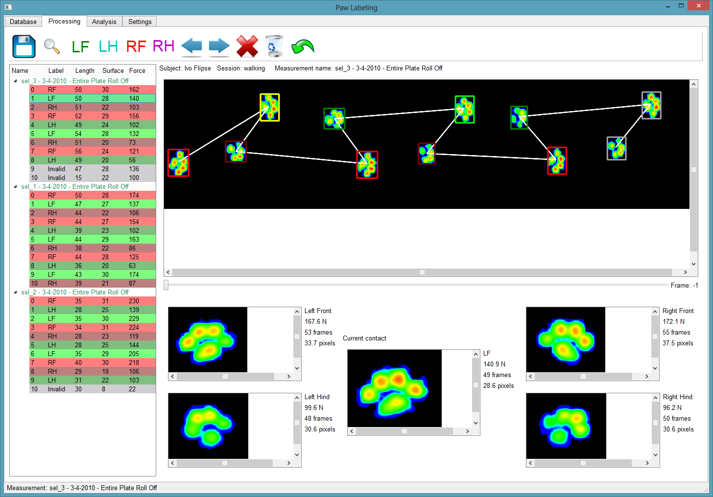

Paw Labeling 
============

Overview
--------

Paw Labeling is a tool to process veterinary pressure measurements.
It can currently import RSscan, Zebris and Tekscan entire plate export-files.

It loads your export files, tracks them for contacts and lets you manually label them (Left Front, LF; Left Hind, LH; 
Right Front, RF; Right Hind, RH).

After the labeling has been saved, you can analyse the data by switching to the Analysis tab. The current version displays:

- an image of the maximal pressure for each sensor for the average of all contacts for each paw;
- graphs of the pressure over time with an average + std's and one highlighted contact;
- graphs of the force over time with an average + std's and one highlighted contact;
- an image of the maximal pressure with the COP.

There's a slider for the results which allows you to make the average results roll off or scroll a line along the graphs.

Features
--------

- Add subjects to a PyTables database
- Load measurements and track where the paws have made contact
- Enable manual labeling of the contacts with their respective paw and saving of the results for later use
- Analysis of the average results or individual contacts

Screenshots
-----------

Installation
-----

Requires Python 2 (2.6 or newer), Python 3 is not supported because of the lack of OpenCV wrappers.

I strongly recommend that you consider installing Python packages with pip, as in it is the current preferred method.
If you are using pip, you can directly install all the dependencies from the requirements file using
`pip install -r requirements.txt`

Alternatively, you can download a package manager like [Anaconda](http://continuum.io/downloads) or
a scientific distribution like [Python(x,y)](https://code.google.com/p/pythonxy/).
This is especially recommendable if you're not used to using Python and are a Windows user. Please check 
whether you're using 32 or 64 bit Python, because you'll have to download the respective library versions.
I recommend using 64 bit Python where possible, since the application at times uses lots of memory.

In any case, you need to install:

- [OpenCV](http://www.lfd.uci.edu/~gohlke/pythonlibs/#opencv)
- [PySide](http://www.lfd.uci.edu/~gohlke/pythonlibs/#pyside)
- [PyPubsub](http://pubsub.sourceforge.net/) (note that version 3.2 seems broken at the moment)
- Numpy (included in Acaconda)
- Scipy (included in Acaconda)
- PyTables (included in Anaconda)
- Nose (for testing only, included in Anaconda)

Usage
-----

**1. Edit `settings/settings.ini` for your system**

Apply the following changes:

- Change `measurment_folder` to the folder containing all your measurements organized as described above.
- Change the `database_folder` to the folder where you want your PyTables database to be stored.
- Set your plate to your specific brand and model, if your brand is not supported, please contact me.
- Change the `main_window_height` and `main_window_width` depending on your screen resolution and change the degree of interpolation if the images don't fit your screen.
- Adjust the keyboard shortcuts in case you lack a keypad (for example on a laptop)

**2. Run `pawlabeling.py` to start the tool**

Create a new subject, create a session (like 'walking' or 'trotting'), add all the relevant measurements to it. 
This will also track for contacts and mark any incomplete steps as `Invalid` if they touch the edges of the 
plate or if they were not finished before the end of the measurement. You can now switch to the Processing 
tab for labeling your paws.

**3. Label all your contacts**

Use the keypad to label the currently selected paw (highlighted in yellow):

	7	9		LF	RF	
			->
	1	3		LH	RH

You can switch the currently selected contact by pressing `4` or `6`. Remove a label using `5`, undo the 
previous label using `Ctrl+Z` and mark a contact as invalid by pressing `Del`.

**4. Save your results**

After you've labeled all contacts, press `Ctrl+S` to save your results. Now you can select the next measurement 
for labeling. It will automatically load the previous results, so they can aid you while labeling.

**5. Analyse your results**

When you've saved the labels for several measurements you can switch to the Analysis mode (click the tab at the 
top) and start looking at your results. Averages for each paw are calculated automatically.

Contact
----------

Post bugs and issues on github. Send other comments to Ivo Flipse: first last at geemail dotcom or @ivoflipse5